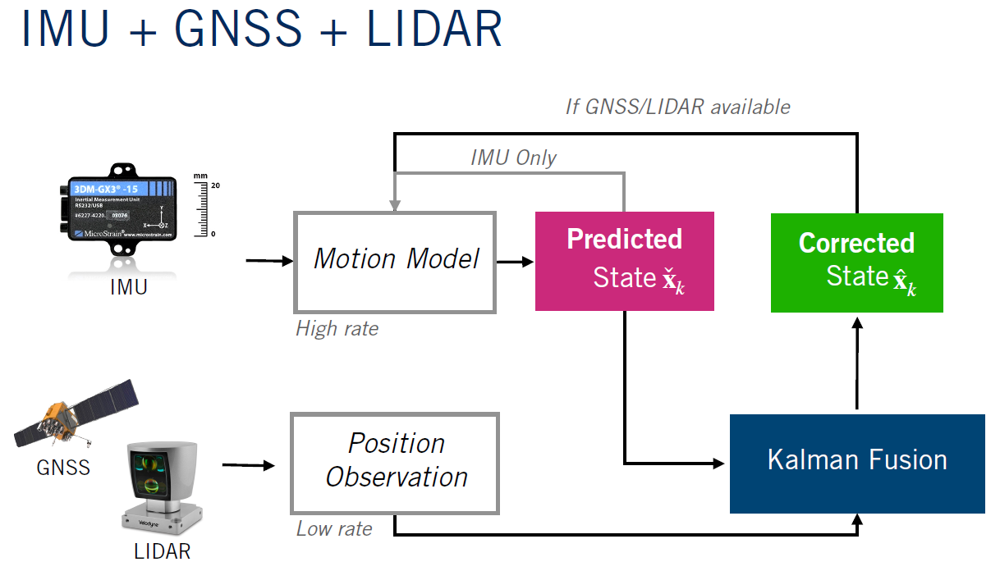
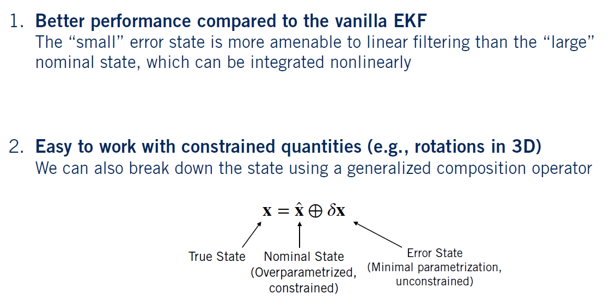
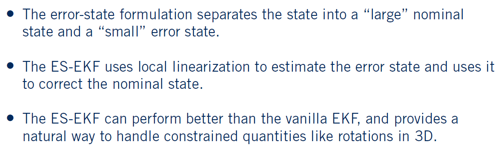

# Self-Driving-Vehicle-State-Estimator [Python]
Self Driving Vehicle State Estimator using Rrror state extended common filter for Sensor measurenments fusion to provde reasonable estimate of the vehicle's pose and velocity. 

## 1 - Overview 
The project is provided with a data set gathered during a test drive in the carless simulator. The data set contains measurements from a sensor array on a moving self-driving car. The sensor array consists of an IMU, a GNSS receiver, and a LiDAR, all of which provide measurements of varying reliability and at different rates. While driving, the vehicle is subject to various dynamic effects caused by the environment, the drive train, and the suspension. These effects are difficult to accurately model. Therefore, in a self-driving scenario, the vehicle controller will rely on measurements acquired by the sensors. The goal is to implement a state estimator that fuses the available sensor measurements to provide a reasonable estimate of the vehicle's pose and velocity. Specifically, I will be implementing the Error state extended Kalman filter [ES-EKF]. Since it provides a high degree of robustness, and is a staple in state estimation. 

## 2 - Architecture 

## 3 - Error state extended Kalman filter [ES-EKF]

### 3.1 - Why ES-EKF?

### 3.2 - Summary

## 4 - Output 

